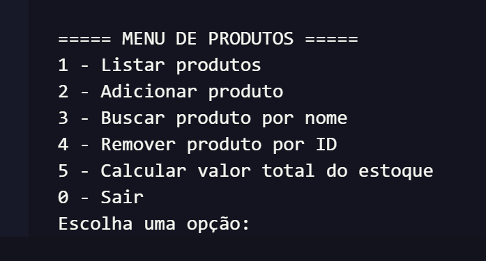

# Gerenciador de Produtos

Projeto simples feito em JavaScript para praticar arrays, funções, módulos e métodos de array.

O sistema funciona pelo terminal e permite cadastrar, listar, buscar, remover produtos e calcular o valor total do estoque.

## Menu do sistema

O projeto possui um menu interativo no terminal:

## Tecnologias usadas

- JavaScript
- Node.js
- Módulos ES Modules
- Readline
